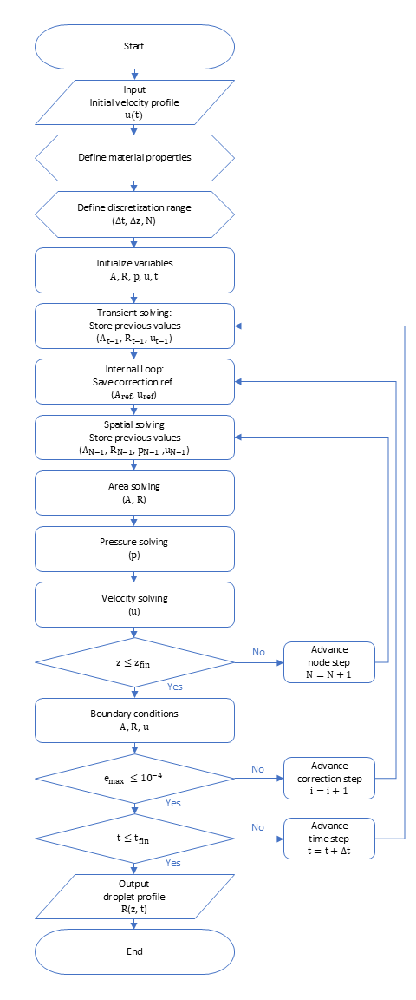

# **A Study on Droplet Formation Stability in an Axisymmetric Slender Jet**

Piezoelectric inkjet technology is widely used for precise, non-contact droplet deposition in advanced manufacturing applications. Its use has recently expanded to printed electronics, bioprinting, functional coating, and micro-scale patterning. However, stable droplet formation remains a major challenge because satellite droplets can be generated depending on ink properties, nozzle geometry, and piezoelectric actuation conditions. In particular, transient changes in interfacial velocity strongly affect the breakup dynamics and formation stability of droplets. Accordingly, this study aims to identify the stable operating range for single-droplet formation according to variations in the initial interfacial velocity. To this end, a transient finite volume model was developed to predict droplet formation behavior in an axisymmetric slender jet. The results showed that droplet formation behavior varied with interfacial velocity under different ink property and voltage conditions. Based on these findings, the best operating case was identified, and the conditions for improved droplet formation stability were determined.

  

<strong>Fig 1. Flowchart of the proposed numerical method</strong>

